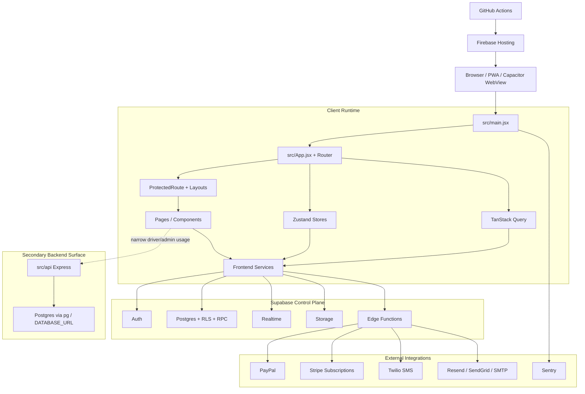
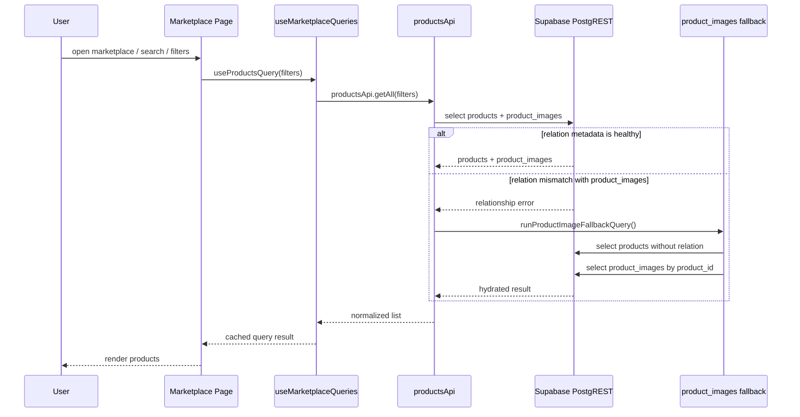
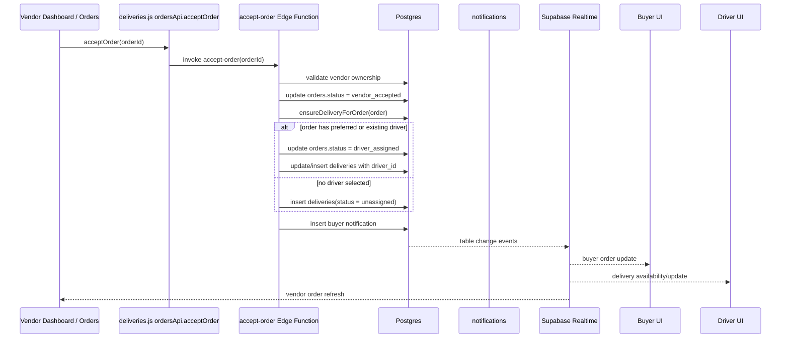
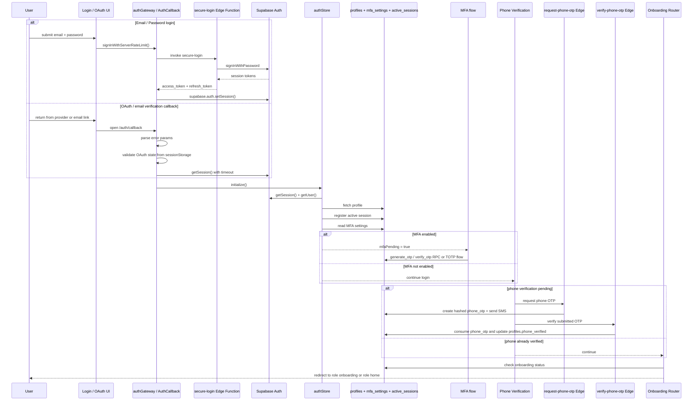
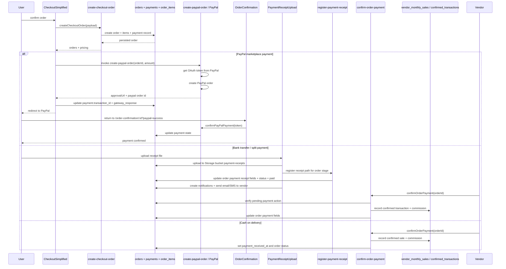
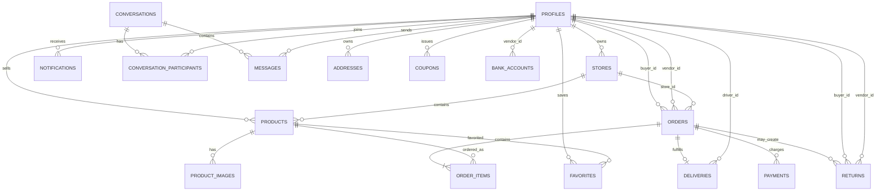
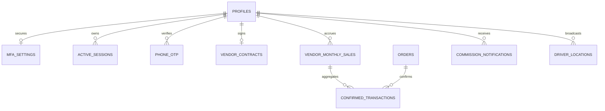
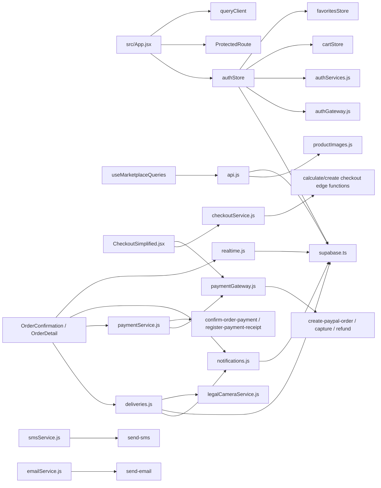
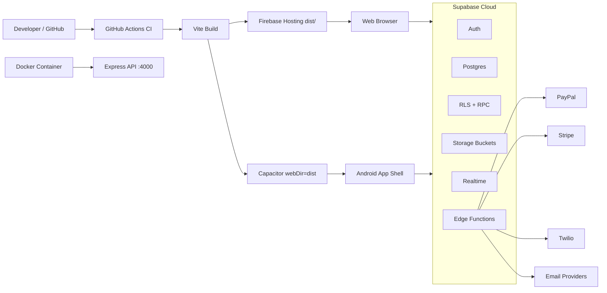
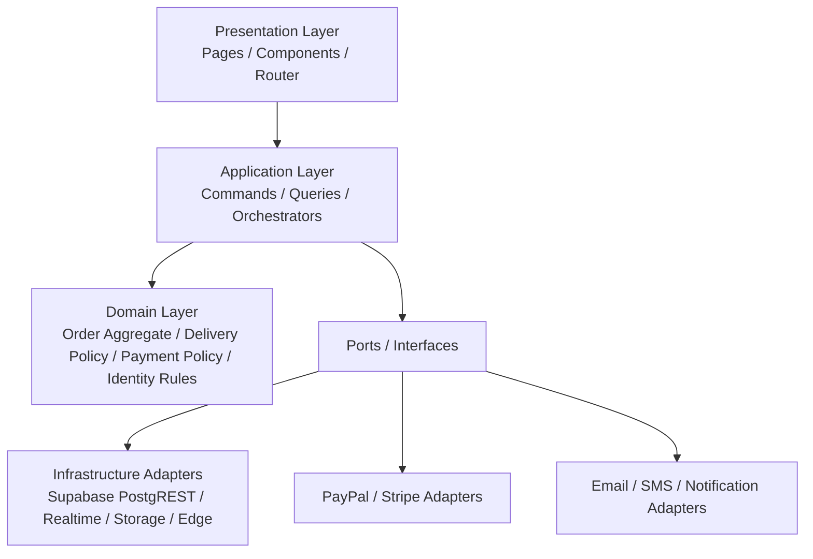

# System Design: Qotoof / Greenmarket

## منهجية التحليل

هذا المستند مبني على قراءة الكود الفعلي الموجود في المستودع الحالي `greenmarket` فقط، وليس على README أو على افتراضات نمطية عن React أو Supabase.

مصادر الحقيقة الأساسية التي بُني عليها هذا التحليل:

- `src/main.jsx`
- `src/App.jsx`
- `src/components/ProtectedRoute.jsx`
- `src/store/authStore.js`
- `src/services/supabase.ts`
- `src/services/api.js`
- `src/services/deliveries.js`
- `src/services/realtime.js`
- `src/services/authGateway.js`
- `src/services/authServices.js`
- `src/services/phoneOtpService.js`
- `src/services/checkoutService.js`
- `src/services/paymentGateway.js`
- `src/services/paymentService.js`
- `src/pages/CheckoutSimplified.jsx`
- `src/pages/OrderConfirmation.jsx`
- `src/pages/OrderDetail.jsx`
- `src/pages/auth/AuthCallback.jsx`
- `src/api/*`
- `supabase/functions/*`
- `database/migrations/000-complete-fresh-setup.sql`
- `supabase/migrations/*`
- `migrations/create_driver_tables.sql`
- `firebase.json`
- `vite.config.js`
- `Dockerfile`
- `docker-compose.yml`
- `capacitor.config.ts`
- `.github/workflows/*`

## حالة الإصلاحات الجارية

### الإصلاح 1

- التاريخ: `2026-05-18`
- المسار: `supabase/functions/send-sms/index.ts`
- المشكلة المثبتة: وظيفة `send-sms` كانت تطبق rate limiting عبر `Map` داخل الذاكرة، ما يجعل الحماية غير موثوقة عبر تعدد الـ instances أو الـ cold starts.
- الإصلاح المنفذ: استبدال الـ rate limit المحلي بآلية `enforceServerRateLimit` المعتمدة على `enforce_rate_limit` داخل قاعدة البيانات، مع الحفاظ على نفس السقف المنطقي `20 request / 60s`.
- الأثر المعماري: حماية SMS أصبحت موزعة ومتسقة مع مسارات إنتاجية أخرى مثل `secure-login` و`public-order-tracking`.

### الإصلاح 2

- التاريخ: `2026-05-18`
- المسار: `supabase/functions/send-email/index.ts`
- المشكلة المثبتة: وظيفة `send-email` كانت تطبق rate limiting عبر `Map` داخل الذاكرة، ما يجعل الحماية غير متسقة بين الـ instances ومعرّضة للالتفاف تشغيليًا.
- الإصلاح المنفذ: استبدال الـ rate limit المحلي بآلية `enforceServerRateLimit` المعتمدة على قاعدة البيانات، مع الحفاظ على نفس السقف المنطقي `60 request / 60s`.
- الأثر المعماري: أصبحت قناتا الإرسال العامتان `send-sms` و`send-email` موحدتين على نفس آلية الحماية الموزعة المستخدمة في الوظائف العامة الحساسة.

### الإصلاح 3

- التاريخ: `2026-05-18`
- المسار: `supabase/functions/get-bank-details/index.ts`
- المشكلة المثبتة: endpoint العام `get-bank-details` كان يقيّد الطلبات عبر `Map` داخل الذاكرة رغم أنه endpoint عام ومعرّض للـ abuse.
- الإصلاح المنفذ: استبدال الـ rate limit المحلي بآلية `enforceServerRateLimit` مع الإبقاء على الـ cache الحالية وسلوك الردود كما هو.
- الأثر المعماري: endpointات القراءة/الإرسال العامة الأكثر حساسية أصبحت تعتمد على rate limiting موزع بدل الحماية المرتبطة بعمر الـ instance فقط.

### الإصلاح 4

- التاريخ: `2026-05-18`
- المسارات: `supabase/functions/request-phone-otp/index.ts` و`src/services/phoneOtpService.js`
- المشكلة المثبتة: إصدار OTP للهاتف كان يبدأ من العميل: المتصفح كان يولّد الرمز ويهشّه ويكتب إلى `phone_otp` ثم يطلب إرسال SMS.
- الإصلاح المنفذ: إنشاء Edge Function مصادَق عليها `request-phone-otp` بحيث يتم توليد OTP وهشّه وتخزينه وإرسال SMS من الخادم، مع تنظيف السجل إذا فشل الإرسال، ثم تحويل `sendPhoneOTP` في العميل لاستخدام هذه الوظيفة مع الحفاظ على نفس contract الظاهري.
- الأثر المعماري: مسار إصدار OTP للهاتف أصبح server-authoritative بدل أن يكون client-authoritative، وهو تقليص مباشر لسطح الهجوم على تدفق التحقق بالهاتف.

### الإصلاح 5

- التاريخ: `2026-05-18`
- المسارات: `supabase/functions/verify-phone-otp/index.ts` و`src/services/phoneOtpService.js`
- المشكلة المثبتة: بعد نقل إصدار OTP للخادم، بقي التحقق نفسه وإدارة المحاولات وتحديث `profiles.phone_verified` تُنفذ من العميل مباشرة.
- الإصلاح المنفذ: إنشاء Edge Function مصادَق عليها `verify-phone-otp` بحيث تتم مطابقة الرمز وتحديث المحاولات واستهلاك OTP وتحديث حالة الهاتف من الخادم، ثم تحويل `verifyPhoneOTP` في العميل لاستخدامها مع الحفاظ على نفس contract الظاهري.
- الأثر المعماري: تدفق التحقق بالهاتف أصبح كاملًا server-authoritative من الإصدار حتى التحقق النهائي.

### الإصلاح 6

- التاريخ: `2026-05-18`
- المسارات: `supabase/functions/accept-order/index.ts` و`src/services/deliveries.js`
- المشكلة المثبتة: `ordersApi.acceptOrder` كان ينفذ قبول الطلب من العميل مباشرة، بما يشمل تحديث `orders` وإنشاء/تحديث `deliveries` وإدراج `notifications`.
- الإصلاح المنفذ: إنشاء Edge Function مصادَق عليها `accept-order` تتحقق من هوية البائع وملكية الطلب، ثم تنفذ قبول الطلب وإنشاء التوصيل أو ربط السائق والإشعارات من الخادم، مع تحويل `ordersApi.acceptOrder` في العميل إلى مجرد invoke لهذه الوظيفة.
- الأثر المعماري: قبول الطلب أصبح server-authoritative بدل client-authoritative، وتم تقليص surface الكتابة الحساسة في مسار الطلبات من المتصفح.

### الإصلاح 7

- التاريخ: `2026-05-18`
- المسارات: `supabase/functions/reject-order/index.ts` و`src/services/deliveries.js`
- المشكلة المثبتة: `ordersApi.rejectOrder` كان يرفض الطلب من العميل مباشرة، بما يشمل تحديث `orders` وإنشاء إشعار المشتري من المتصفح.
- الإصلاح المنفذ: إنشاء Edge Function مصادَق عليها `reject-order` تتحقق من هوية البائع وملكية الطلب، ثم تنفذ رفض الطلب وإشعار المشتري من الخادم، مع تحويل `ordersApi.rejectOrder` في العميل إلى invoke لهذه الوظيفة.
- الأثر المعماري: أوامر قبول ورفض الطلب أصبحتا server-authoritative، ولم يعد المتصفح يملك مسارًا مباشرًا لرفض الطلب أو توليد إشعار الرفض.

### الإصلاح 8

- التاريخ: `2026-05-18`
- المسارات: `supabase/functions/accept-delivery/index.ts` و`src/services/deliveries.js`
- المشكلة المثبتة: `deliveriesApi.acceptDelivery` كان يسمح بقبول مهمة التوصيل وتحديث `orders` وتوليد إشعارات البائع والمشتري من واجهة السائق مباشرة.
- الإصلاح المنفذ: إنشاء Edge Function مصادَق عليها `accept-delivery` تتحقق من هوية السائق وتنفذ race guard الحالي على مستوى الخادم، ثم تحدّث `deliveries` و`orders` وترسل إشعارات القبول من الخادم، مع تحويل `deliveriesApi.acceptDelivery` في العميل إلى invoke لهذه الوظيفة.
- الأثر المعماري: قبول مهمة التوصيل أصبح server-authoritative، وتقلصت الكتابة الحساسة المباشرة من واجهات السائق.

### الإصلاح 9

- التاريخ: `2026-05-18`
- المسارات: `supabase/functions/mark-delivery-picked-up/index.ts` و`src/services/deliveries.js`
- المشكلة المثبتة: `deliveriesApi.markPickedUp` كان يتحقق من وجود الصورة القانونية `driver_loading` ويحدث `deliveries` و`orders` من العميل مباشرة.
- الإصلاح المنفذ: إنشاء Edge Function مصادَق عليها `mark-delivery-picked-up` تتحقق من السائق ومن وجود التوثيق القانوني في `product_condition_photos` ثم تنفذ انتقال `picked_up` وتحديث حالة الطلب من الخادم، مع تحويل `deliveriesApi.markPickedUp` في العميل إلى invoke لهذه الوظيفة.
- الأثر المعماري: شرط الإثبات القانوني لمرحلة التحميل وانتقال `picked_up` أصبحا server-authoritative بدل الاعتماد على تحقق عميل قابل للتجاوز.

### الإصلاح 10

- التاريخ: `2026-05-18`
- المسارات: `supabase/functions/mark-delivery-delivered/index.ts` و`src/services/deliveries.js`
- المشكلة المثبتة: `deliveriesApi.markDelivered` كان يتحقق من وجود الصورة القانونية `driver_dropoff` ويغلق `deliveries` و`orders` من العميل مباشرة.
- الإصلاح المنفذ: إنشاء Edge Function مصادَق عليها `mark-delivery-delivered` تتحقق من السائق ومن وجود التوثيق القانوني في `product_condition_photos` ثم تنفذ انتقال `delivered` وتحديث حالة الطلب من الخادم، مع تحويل `deliveriesApi.markDelivered` في العميل إلى invoke لهذه الوظيفة.
- الأثر المعماري: شرط الإثبات القانوني لمرحلة ما قبل التسليم وإنهاء التوصيل نفسه أصبحا server-authoritative بدل الاعتماد على تحقق عميل قابل للتجاوز.

### الإصلاح 11

- التاريخ: `2026-05-18`
- المسارات: `supabase/functions/reject-delivery/index.ts` و`src/services/deliveries.js`
- المشكلة المثبتة: `deliveriesApi.rejectDelivery` كان يعيد فتح مهمة التوصيل ويعيد حالة الطلب من العميل مباشرة من دون ربط العملية بالسائق المصادَق عليه أو بقيد حالة واضح داخل الكود.
- الإصلاح المنفذ: إنشاء Edge Function مصادَق عليها `reject-delivery` تتحقق من هوية السائق وتسمح بالرفض فقط عندما تكون المهمة مملوكة له وفي حالة صالحة (`assigned` أو `accepted`)، ثم تعيد `deliveries` و`orders` من الخادم، مع تحويل `deliveriesApi.rejectDelivery` في العميل إلى invoke لهذه الوظيفة.
- الأثر المعماري: رفض مهمة التوصيل أصبح server-authoritative أيضًا، ولم يعد المتصفح يملك مسارًا مباشرًا لفك ربط السائق وإعادة المهمة إلى `unassigned`.

### الإصلاح 12

- التاريخ: `2026-05-18`
- المسارات: `supabase/functions/mark-delivery-on-the-way/index.ts` و`src/services/deliveries.js`
- المشكلة المثبتة: `deliveriesApi.markOnTheWay` كان ينفذ انتقال `on_the_way` ويحدث `orders` من العميل مباشرة، مع الاعتماد على قيد الحالة في استعلام المتصفح نفسه.
- الإصلاح المنفذ: إنشاء Edge Function مصادَق عليها `mark-delivery-on-the-way` تتحقق من السائق وتسمح بالانتقال فقط من حالة `picked_up`، ثم تحدّث `deliveries` و`orders` من الخادم، مع تحويل `deliveriesApi.markOnTheWay` في العميل إلى invoke لهذه الوظيفة.
- الأثر المعماري: انتقال `on_the_way` أصبح server-authoritative، واكتمل بذلك نقل أهم transitions الأساسية لدورة التوصيل من المتصفح إلى أوامر خادمية.

### الإصلاح 13

- التاريخ: `2026-05-18`
- المسارات: `supabase/functions/assign-driver/index.ts` و`src/services/deliveries.js`
- المشكلة المثبتة: `deliveriesApi.assignDriver` كان يُستخدم فعليًا من واجهات البائع لربط سائق بمهمة التوصيل عبر update مباشر على `deliveries` من العميل، من دون تحقق server-side من ملكية البائع للطلب المرتبط.
- الإصلاح المنفذ: إنشاء Edge Function مصادَق عليها `assign-driver` تتحقق من هوية المستخدم ومن أن الطلب المرتبط بالمهمة يخص هذا البائع، ثم تنفذ الربط فقط عندما تكون حالة المهمة `unassigned` أو `driver_assigned`، مع تحويل `deliveriesApi.assignDriver` في العميل إلى invoke لهذه الوظيفة.
- الأثر المعماري: التعيين اليدوي للسائق لم يعد تفويضه معتمدًا على RLS العميل فقط، بل أصبح قرارًا خادميًا مرتبطًا بملكية الطلب.

### الإصلاح 14

- التاريخ: `2026-05-18`
- المسارات: `src/components/ui/DeliveryRequestCard.jsx`
- المشكلة المثبتة: بطاقة طلب التوصيل في لوحة السائق كانت bypass لمسار الخدمة الرسمي، إذ تكتب على `orders` مباشرة عند القبول بدل المرور عبر `deliveriesApi.acceptDelivery`، وتُبقي منطق الرفض خارج `deliveriesApi.rejectDelivery`.
- الإصلاح المنفذ: تحويل البطاقة لاستخدام `deliveriesApi.acceptDelivery` و`deliveriesApi.rejectDelivery` بدل الكتابة المباشرة على `orders`، مع الإبقاء مؤقتًا على إشعار الرفض العميلي فقط كأثر جانبي غير تفويضي.
- الأثر المعماري: واجهة السائق الأساسية لم تعد تلتف على أوامر دورة التوصيل الرسمية، وأصبح تطبيق مسارات القبول/الرفض الخادمية أكثر اتساقًا على مستوى الواجهة.

الاستنتاج المعماري الأكثر أهمية من الكود الحالي:

1. المسار التشغيلي الأساسي للتطبيق هو: `React SPA + Supabase Auth + PostgREST + Realtime + Storage + Edge Functions`.
2. يوجد سطح Backend إضافي مبني على `Express + pg` داخل `src/api`، لكنه في المستودع الحالي محدود جدًا ويغطي بشكل أساسي مسارات السائقين/إدارة السائقين.
3. يوجد أيضًا مسار schema متعارض خاص بالسائقين داخل `migrations/create_driver_tables.sql` يعتمد على `users/drivers` بدل `profiles/auth.users`، وهذا ليس منسجمًا مع المسار الأساسي للتطبيق.

بالتالي، المعمارية الحقيقية ليست Monolith Node API كلاسيكي، وليست أيضًا Frontend-only، بل هي:

- Frontend غني بالمنطق orchestration-heavy.
- Backend-as-a-platform عبر Supabase.
- Edge Functions لعمليات الكتابة الحساسة: auth server-side login، checkout، PayPal، payment confirmation، auto-assign، البريد وSMS.
- Express sidecar محدود وموازٍ، وليس مركز الثقل الأساسي.

---

## 1. نظرة عامة عالية المستوى على المعمارية

### 1.1 الصورة العامة

التطبيق هو سوق متعدد الأدوار يدعم:

- `buyer`
- `vendor`
- `driver`
- `admin`

العميل يعمل كتطبيق React أحادي الصفحة مع تقسيم Lazy حسب الدور، ويحمّل التهيئة العامة عند الإقلاع، ثم يعتمد على:

- `Zustand` لإدارة auth/cart/favorites/language.
- `TanStack Query` لطلبات القراءة وإدارة caching/retries.
- `Supabase JS Client` كممر أساسي إلى Auth وPostgREST وRealtime وStorage وEdge Functions.
- `ProtectedRoute` لتطبيق RBAC وتكوين لوحات الإدارة/البائع/السائق.

### 1.2 النمط المعماري الفعلي

النمط الفعلي أقرب إلى:

- `Client-heavy modular SPA`
- `BaaS-centric backend`
- `Function-oriented command backend`

وليس إلى:

- REST API مركزية واحدة خلف Express
- Microservices كاملة الانفصال
- Clean Architecture مطبقة حرفيًا

### 1.3 أين توجد المسؤولية الفعلية؟

| الطبقة | المسؤولية الفعلية |
| --- | --- |
| Browser / PWA / Capacitor | عرض الواجهة، حفظ session client-side، الاشتراك في Realtime، تنفيذ orchestration UI |
| React App | توجيه المستخدم، الحماية حسب الدور، onboarding، phone verification، بدء flows التجارية |
| Frontend Services | تجميع منطق الدومين على العميل: catalog، orders، deliveries، payments، notifications |
| Supabase Postgres + RLS | مصدر البيانات الرئيسي لجميع الكيانات الأساسية |
| Supabase Edge Functions | العمليات الحساسة أو المعقدة أو التي تحتاج secrets أو service role |
| Supabase Realtime | بث تغيرات orders/deliveries/notifications/products |
| Supabase Storage | إيصالات الدفع، المستندات، الملفات المرفقة |
| Express API | سطح ضيق موازٍ لإدارة السائقين مبني على `pg` و`DATABASE_URL` |
| External Providers | PayPal، Stripe، Twilio، مزود بريد، Sentry |

### 1.4 الحكم النهائي على المسارات الموجودة في المستودع

| السطح | الحالة المعمارية |
| --- | --- |
| `src/services/api.js` + `supabase` | مسار حي أساسي |
| `src/services/deliveries.js` + `realtime.js` | مسار حي أساسي |
| `supabase/functions/create-checkout-order` | مسار حي أساسي |
| `supabase/functions/secure-login` | مسار حي أساسي |
| `src/api/*` | مسار ثانوي/جزئي |
| `axiosInstance.js` | موجود لكن استخدامه محدود جدًا في `main` الحالي |
| `migrations/create_driver_tables.sql` | مسار schema متضارب مع الـ schema الأساسي |

---

## 2. خريطة العلاقات بين المكونات



### 2.1 العلاقات المهمة فعليًا

1. `src/main.jsx` يبدأ التطبيق ويهيئ Sentry وperformance/security hooks وanalytics وconfig العام.
2. `src/App.jsx` هو مركز التوجيه الفعلي، ويحتوي أيضًا على منطق auth initialization وphone verification وonboarding gating.
3. `authStore.js` هو البوابة الفعلية بين Supabase Auth والواجهة، وليس مجرد store عرضي.
4. `api.js` و`deliveries.js` و`checkoutService.js` و`paymentService.js` تمثل الطبقة التطبيقية الحقيقية على الواجهة.
5. `Supabase Edge Functions` تمثل backend command layer للعمليات الحساسة.
6. `src/api` ليس في قلب المعمارية الحالية، بل سطح موازٍ محدود.

---

## 3. مخططات تدفق الطلبات Request Flow Diagrams

### 3.1 تدفق قراءة المنتجات في السوق



هذه النقطة مهمة جدًا: التطبيق يحتوي بالفعل على fallback يعالج فشل علاقة `products -> product_images` داخل PostgREST، وهذا دليل مباشر على وجود schema drift أو relation metadata drift.

### 3.2 تدفق إنشاء الطلب في Checkout

```mermaid
sequenceDiagram
    participant U as User
    participant C as CheckoutSimplified
    participant CS as checkoutService
    participant Pricing as calculate-checkout-pricing
    participant Create as create-checkout-order
    participant DB as Postgres

    U->>C: enter address / city / map location / payment setup
    C->>CS: calculateCheckoutPricing(payload)
    CS->>Pricing: invoke edge function
    Pricing->>DB: read products, delivery rules, coupon, driver setup
    DB-->>Pricing: authoritative pricing inputs
    Pricing-->>CS: pricing result
    CS-->>C: shipping + totals + ETA

    U->>C: confirm checkout
    C->>CS: createCheckoutOrder(payload + idempotencyKey)
    CS->>Create: invoke edge function
    Create->>DB: validate auth + idempotency
    Create->>DB: reserve inventory
    Create->>DB: insert orders
    Create->>DB: insert order_items
    Create->>DB: insert payments
    Create->>DB: persist checkout_requests
    DB-->>Create: created order set
    Create-->>CS: orders + pricing
    CS-->>C: authoritative response
```

### 3.3 تدفق قبول الطلب والتوصيل



### 3.4 تدفق صفحة الطلب بعد الإنشاء

صفحات مثل `OrderConfirmation.jsx` و`OrderDetail.jsx` لا تعتمد على DTO backend موحد، بل تعيد تركيب order view عبر عدة queries:

1. قراءة `orders`.
2. قراءة `order_items`.
3. قراءة سجل الدفع من `payments`.
4. قراءة buyer profile.
5. قراءة vendor profile.

هذا يجعل الشاشة غنية بالمعلومات، لكنه يرفع coupling وعدد الرحلات إلى قاعدة البيانات.

---

## 4. مخطط تدفق المصادقة Authentication Flow



### 4.1 ملاحظات تنفيذية دقيقة

1. تسجيل الدخول بكلمة المرور لا يذهب مباشرة من المتصفح إلى `supabase.auth.signInWithPassword`، بل يمر عبر `secure-login` للحصول على rate limiting على الخادم.
2. `AuthCallback.jsx` ينفذ OAuth state validation فعليًا من `sessionStorage` قبل إتمام الجلسة.
3. `authStore.initialize()` يسجل الجلسة في `active_sessions` ويبدأ auto-logout ويقرر ما إذا كان يجب إيقاف المستخدم عند MFA أو phone verification أو onboarding.
4. إصدار OTP للهاتف والتحقق منه أصبحا يمران عبر `request-phone-otp` و`verify-phone-otp` بدل التعديل المباشر من العميل على الجداول.
5. انتهاء الجلسة يطلق حدث `auth:sessionExpired` ثم يقوم `App.jsx` بإرجاع المستخدم إلى `/login?expired=true`.

---

## 5. مخطط تدفق الدفع Payment Flow



### 5.1 ملاحظات مهمة عن الدفع

1. `PayPal` هو المسار النشط لمدفوعات marketplace الإلكترونية.
2. `bank transfer` و`split payment` يعتمدان على رفع إيصالات إلى Storage ثم مراجعة البائع.
3. `COD` لا يمر عبر مزود خارجي، لكن تأكيده من البائع يحفز منطق العمولات.
4. `Stripe` موجود، لكنه في الكود الحالي مخصص لاشتراكات البائعين، وليس لمسار checkout الرئيسي للطلبات.
5. `CMI` بقي كطبقة توافقية legacy في بعض الخدمات، لكن checkout الحالي نفسه يصرّح بأن CMI retired.

---

## 6. العلاقات بين جداول وكيانات قاعدة البيانات

### 6.1 الـ Core Commerce ERD



### 6.2 الجداول الأمنية والتشغيلية والمالية



### 6.3 أهم الكيانات ووظيفتها

| الكيان | الدور في النظام |
| --- | --- |
| `profiles` | الكيان المحوري للمستخدمين والأدوار والخصائص المشتركة، ويرتبط بـ `auth.users` |
| `stores` | تمثيل المتجر التجاري للبائع |
| `products` | الكتالوج الرئيسي، مع ربط اختياري بالمتجر والبائع |
| `product_images` | صور المنتج، مع مؤشرات على وجود drift في العلاقة مع PostgREST |
| `orders` | Aggregate محوري للشراء والحالة والتوصيل والدفع |
| `order_items` | العناصر التابعة للطلب |
| `deliveries` | طبقة تنفيذ التوصيل وربط الطلب بالسائق والحالة الميدانية |
| `payments` | سجل المدفوعات والمرجع الخارجي للمعاملات |
| `notifications` | مركز الإشعارات داخل التطبيق |
| `active_sessions` | إدارة الجلسات النشطة من منظور التطبيق |
| `mfa_settings` | إعدادات MFA |
| `phone_otp` | تحقق الهاتف |
| `vendor_monthly_sales` | وعاء تراكم مبيعات البائع الشهرية لأغراض العمولة |
| `confirmed_transactions` | سجل المعاملات التي تم تثبيتها كدخل وعمولة |

### 6.4 الملاحظة الأهم على مستوى الـ schema

يوجد **انقسام واضح** بين مصدرين للبنية:

1. الـ schema الأساسي في `database/migrations/000-complete-fresh-setup.sql` ثم التوسعات اللاحقة في `database/migrations/*` و`supabase/migrations/*`.
2. schema بديل في `migrations/create_driver_tables.sql` يعتمد على جداول `users` و`drivers` و`available_deliveries`.

هذا ليس مجرد duplication وثائقي، بل تعارض بنيوي فعلي؛ لأن المسار الأساسي للتطبيق يستخدم `profiles(id)` المرتبط بـ `auth.users(id)`، بينما schema السائقين البديل يستخدم `users(id)` و`drivers(id)` ككيانات منفصلة.

---

## 7. خريطة اعتماد الخدمات على بعضها



### 7.1 الاعتمادات الأكثر حساسية

1. `authStore` هو dependency hub في جانب الهوية والجلسات.
2. `deliveries.js` ليس مجرد خدمة CRUD، بل يحتوي business transitions وتوليد delivery records وإشعارات.
3. `paymentService.js` و`paymentGateway.js` يشكلان طبقتين فوق بعضهما، مع استمرار أثر legacy methods داخل gateway.
4. `api.js` و`deliveries.js` يوزعان domain logic على خدمتين منفصلتين بدل aggregate boundary موحد للطلب.

---

## 8. خريطة مسؤوليات المجلدات

### 8.1 المستوى الأعلى داخل `src/`

| المسار | المسؤولية الفعلية |
| --- | --- |
| `src/main.jsx` | bootstrap العام: config، security/performance hooks، analytics، Sentry، service worker |
| `src/App.jsx` | route registry + auth/onboarding/phone-verification orchestration |
| `src/components/` | وحدات UI والـ wrappers مثل `ProtectedRoute` ورفع الإيصالات والمكونات المشتركة |
| `src/pages/` | شاشات التطبيق حسب الدور وحسب المسار |
| `src/services/` | طبقة التطبيق الفعلية: auth، catalog، deliveries، checkout، payments، notifications، realtime |
| `src/store/` | Zustand stores للحالة العابرة والمستمرة على العميل |
| `src/hooks/` | hooks عامة وطبقة queries/mutations فوق React Query |
| `src/features/` | استخدام محدود حاليًا؛ ظهر بوضوح `features/auth/components/TwoFactor` |
| `src/api/` | Express sidecar backend محدود |
| `src/lib/` | config loader العام ومنطق منخفض المستوى مشترك |
| `src/layouts/` | Layout components، لكن بعض الـ layouts المستخدمة فعليًا تُركّب أيضًا من `ProtectedRoute.jsx` |
| `src/constants/` | constants تشغيلية مثل الأدوار والمدفوعات والحالات والبنوك |
| `src/config/` | إعدادات تطبيق إضافية مثل `driver.config.js` |
| `src/i18n/` | i18next bootstrap والـ locales |
| `src/utils/` | أدوات مساعدة للأمان، logging، sanitization، encryption، redirects، retry |
| `src/__tests__/` | اختبارات unit/integration للخدمات والتدفقات |

### 8.2 `src/pages/` حسب الدور

| المسار | المسؤولية |
| --- | --- |
| `src/pages/auth/` | login/register/reset/callback/verify |
| `src/pages/onboarding/` | onboarding حسب الدور buyer/vendor/driver |
| `src/pages/buyer/` | dashboard، orders، addresses، loyalty، coupons، security، shopping lists، RFQ |
| `src/pages/vendor/` | dashboard، products، orders، analytics، profile، delivery option، contract، subscription، RFQs |
| `src/pages/admin/` | users، vendors، drivers، products، orders، moderation، commissions، payouts، disputes، fraud، support |
| `src/pages/driver/` | active/available/history/earnings/profile/delivery tracking |

### 8.3 `src/services/` حسب المجال

| المسار | المسؤولية |
| --- | --- |
| `authGateway.js` | server-side login entrypoint عبر `secure-login` |
| `authServices.js` | MFA، active sessions، auto logout |
| `supabase.ts` | Supabase client + health monitor + session retry behavior |
| `api.js` | PostgREST reads/writes للمنتجات والطلبات وإدارة السوق |
| `deliveries.js` | order acceptance، delivery lifecycle، subscriptions، transitions |
| `realtime.js` | wrapper موحد لاشتراكات Supabase Realtime |
| `checkoutService.js` | bridge إلى `calculate-checkout-pricing` و`create-checkout-order` |
| `paymentGateway.js` | orchestration لطرق الدفع marketplace |
| `paymentService.js` | wrappers مسماة + edge calls لسجلات الدفع وتأكيده |
| `notifications.js` | مركز الإشعارات والتفضيلات وnormalization |
| `phoneOtpService.js` | إرسال/التحقق من OTP للهاتف وحفظ pending state في sessionStorage |
| `emailService.js` / `sms/` | إخراج البريد والرسائل النصية |
| `deliveryMatchingService.js` | اختيار السائقين في checkout |
| `driverLocationService.js` | بث وتتبع موقع السائق/التوصيل |

### 8.4 المسارات خارج `src/`

| المسار | المسؤولية |
| --- | --- |
| `database/migrations/` | source طويل المدى للـ schema الأساسية والتوسعات التطبيقية |
| `supabase/migrations/` | migrations موجهة أكثر للـ Supabase والميزات الحديثة والـ auth والcheckout |
| `supabase/functions/` | command backend الحقيقي للعمليات الحساسة |
| `migrations/create_driver_tables.sql` | schema بديلة/متعارضة خاصة بالسائقين |
| `.github/workflows/` | CI/CD والمراقبة |
| `android/` | shell أندرويد عبر Capacitor |
| `Dockerfile` و`docker-compose.yml` | تشغيل وتطوير الـ Express API فقط، وليس كامل المنصة |
| `cypress/` + `cypress.config.js` | E2E testing surface |

---

## 9. نظرة عامة على البنية التحتية Infrastructure



### 9.1 الاستضافة والنشر

1. الواجهة الأمامية تُبنى عبر Vite.
2. `firebase.json` يوجّه `public` إلى `dist` ويعيد كتابة كل المسارات إلى `index.html`، ما يؤكد أن Firebase Hosting يخدم الـ SPA مباشرة.
3. مسارات GitHub Actions الفعلية الحالية:
   - `ci.yml`
   - `cd.yml`
   - `pr-preview.yml`
   - `monitoring.yml`

### 9.2 طبقة البيانات والخلفية المُدارة

Supabase هو البنية الخلفية الأساسية فعليًا:

- Auth
- Postgres
- Storage
- Realtime
- Edge Functions
- RPC functions

### 9.3 التهيئة العامة Runtime Config

التطبيق لا يعتمد فقط على `import.meta.env` مباشرة، بل يحمّل public config من Edge Function `get-public-config` عبر `src/lib/config.ts` عند الإقلاع.

هذا يجعل البيئة التشغيلية موزعة بين:

- build-time env
- public runtime env عبر Edge Function
- secrets محفوظة داخل Edge Functions

### 9.4 الحاويات والـ local dev

`Dockerfile` و`docker-compose.yml` لا يبنيان كامل المنصة، بل يبنيان فقط خدمة `src/api/app.js` مع قاعدة PostgreSQL محلية لـ Express sidecar.

هذا يعني أن الحاويات الحالية لا تمثل البنية الإنتاجية الفعلية للتطبيق ككل، لأن المسار الإنتاجي الرئيسي يعتمد على Supabase Cloud وليس على هذا Postgres المحلي.

### 9.5 المراقبة والاعتمادية

- Sentry مهيأ من `src/main.jsx`.
- يوجد workflow مراقبة دورية للإنتاج.
- Realtime لديه reconnect handling داخل `src/services/realtime.js`.
- `supabase.ts` يحتوي monitor صحي ودعم retry لبعض أخطاء JWT/session.

---

## 10. المشاكل والاختناقات المعمارية الموجودة

| المشكلة | الدليل من الكود | الأثر المعماري |
| --- | --- | --- |
| ازدواجية backend | المسار الأساسي يعتمد على Supabase، بينما يوجد `src/api` محدود مع Docker خاص به | تشوش في الملكية التشغيلية وحدود المسؤولية |
| انقسام schema للسائقين | `database/supabase` يستخدمان `profiles/auth.users`، بينما `migrations/create_driver_tables.sql` يستخدم `users/drivers` | خطر drift وفشل الهجرات والـ reporting |
| drift في علاقة `product_images` | وجود `runProductImageFallbackQuery()` و`isProductImagesRelationError()` | زيادة query complexity وكسر contract بين الكود والـ schema |
| منطق الدومين موزع على الواجهة | `App.jsx` و`deliveries.js` و`api.js` و`paymentGateway.js` تحمل business rules مباشرة | صعوبة الاختبار والتطور وضبط الحدود |
| enrichments متعددة لكل شاشة طلب | `OrderConfirmation.jsx` و`OrderDetail.jsx` تجمع order + items + payment + profiles على دفعات | زيادة round trips وتأخير rendering |
| تضارب تطور الجلسات الأمنية | migrations مختلفة لـ `active_sessions` و`mfa_settings` بين `auth.users` و`profiles` وحقول متفاوتة | احتمالية ضعف الاتساق والـ audit trail |
| side effects على مسار الطلب | رفع الإيصال يطلق notification/email/SMS داخل نفس المسار التطبيقي | زمن استجابة أعلى واحتمال partial failure |
| route monolith | `src/App.jsx` ضخم ويجمع route map مع auth orchestration وphone/onboarding gating | coupling مرتفع وصعوبة في maintenance |

### 10.1 الاختناق الأكبر

أكبر اختناق معماري ليس الأداء الخام، بل **غياب حدود domain boundaries الصارمة**.

النتيجة الحالية:

1. بعض الأوامر الحساسة تُدار في Edge Functions.
2. بعض الأوامر الأخرى تُدار مباشرة من العميل إلى الجداول.
3. بعض المسارات القديمة ما زالت موجودة في Express.

هذا يجعل “مكان الحقيقة” في سلوك النظام غير موحد، ويصعّب أي refactor أو hardening لاحق.

---

## 11. مخاطر التوسع Scalability Risks

| الخطر | لماذا سيظهر مع التوسع |
| --- | --- |
| كثرة الاشتراكات Realtime المباشرة | كل دور يشترك في orders/deliveries/notifications/products، ومع زيادة المستخدمين سترتفع fan-out والرسائل المتدفقة |
| شاشات تعتمد على N+1 style enrichment | شاشات الطلبات تؤلف view model عبر عدة queries بدلاً من read model موحد |
| fallback query للصور | أي drift في العلاقات يضاعف الاستعلامات تلقائيًا على صفحات المنتجات والطلبات |
| منطق التسعير يُستدعى كثيرًا أثناء checkout | التغيير في العنوان/الموقع/السائق/slot قد يحفز `calculate-checkout-pricing` مرارًا |
| منطق side effects متزامن | email/SMS/notifications على مسار الطلب أو الإيصال يزيد زمن الاستجابة ويخلق bottlenecks عند الحمل |
| bulk assignment في `auto-assign-driver` | المعالجة batch-by-batch يمكن أن تصبح بطيئة مع ارتفاع unassigned deliveries |
| `select('*')` الواسع في عدة مواضع | payload size وschema coupling يرتفعان مع زيادة الحقول والميزات |

### 11.1 المخاطر الأكثر احتمالاً أولًا

1. بطء صفحات orders/checkout على الشبكات الضعيفة.
2. زيادة ضغط Realtime مع نمو قاعدة المستخدمين النشطة.
3. زيادة هشاشة التكامل عندما يتغير schema بسبب كثرة الاعتماد المباشر على أسماء الأعمدة من الواجهة.

---

## 12. المخاطر الأمنية Security Risks

| الخطر | الدليل من الكود | الملاحظة |
| --- | --- | --- |
| عدد من Edge Functions مفتوحة CORS على `*` | ظاهر في `send-sms` و`send-email` و`confirm-order-payment` و`secure-login` وغيرها | الحماية تعتمد على auth/validation داخل كل function وليس على origin policy |
| كثير من عمليات الكتابة الأساسية تتم مباشرة من العميل إلى الجداول | ما زالت تحديثات `deliveries`, `notifications`, `products` وبعض transitions الطلب موجودة في خدمات الواجهة، رغم نقل التعيين اليدوي للسائق وقبول/رفض الطلب وقبول/رفض مهمة التوصيل ومراحل `picked_up` و`on_the_way` و`delivered` إلى `assign-driver` و`accept-order` و`reject-order` و`accept-delivery` و`reject-delivery` و`mark-delivery-picked-up` و`mark-delivery-on-the-way` و`mark-delivery-delivered`، وربط بطاقة طلب التوصيل نفسها بهذه المسارات بدل bypass مباشر | أي نقص في RLS أو policy drift يتحول مباشرة إلى ثغرة صلاحيات |
| service-role Edge Functions تحمل صلاحيات واسعة | `auto-assign-driver`, `confirm-order-payment`, `create-checkout-order` وغيرها تستخدم service role | أي خطأ منطقي داخل function يتجاوز RLS بالكامل |
| تضارب schema الأمني | تطور `active_sessions` و`mfa_settings` عبر migrations مختلفة وغير منسجمة تمامًا | قد يخلق ثغرات تشغيلية أو على الأقل gaps في التتبع والحوكمة |

### 12.1 نقاط قوة أمنية موجودة فعلًا

التحليل يجب أن يبقى منصفًا؛ توجد أيضًا عناصر hardening حقيقية:

1. `secure-login` يطبق server-side rate limiting قبل تسجيل الدخول.
2. `AuthCallback.jsx` يطبق OAuth state validation.
3. `create-checkout-order` يعتمد auth + idempotency + server-side authoritative writes.
4. `auto-assign-driver` نُقل من المتصفح إلى edge function مع optimistic lock لتقليل التلاعب والسباقات.
5. `verify_otp` و`generate_otp` لهما implementation لاحق فعلي في migrations الحديثة، وليس فقط النسخة التجريبية المبكرة.
6. `send-sms` و`send-email` و`get-bank-details` أصبحوا يستخدمون rate limiting موزعًا على الخادم بدل التخزين داخل الذاكرة.
7. تدفق OTP للهاتف أصبح يمر عبر `request-phone-otp` و`verify-phone-otp` على الخادم بدل التوليد والتحقق من المتصفح.
8. `ordersApi.acceptOrder` و`ordersApi.rejectOrder` لم يعودا يكتبان مباشرة إلى `orders` و`notifications` من العميل، بل يمران عبر `accept-order` و`reject-order` على الخادم مع تحقق ملكية الطلب للبائع.
9. `deliveriesApi.acceptDelivery` لم يعد يقبل المهمة ويحدث `orders` ويولد إشعارات القبول من واجهة السائق مباشرة، بل يمر عبر `accept-delivery` على الخادم مع race guard server-side.
10. `deliveriesApi.markPickedUp` لم يعد يعتمد على تحقق العميل من `driver_loading` أو على تحديث الحالة من المتصفح، بل يمر عبر `mark-delivery-picked-up` مع تحقق server-side من الإثبات القانوني.
11. `deliveriesApi.markDelivered` لم يعد يعتمد على تحقق العميل من `driver_dropoff` أو على إغلاق `deliveries` و`orders` من المتصفح، بل يمر عبر `mark-delivery-delivered` مع تحقق server-side من الإثبات القانوني.
12. `deliveriesApi.rejectDelivery` لم يعد يفك ربط السائق ويعيد الحالة إلى `unassigned` من المتصفح مباشرة، بل يمر عبر `reject-delivery` على الخادم مع ربط العملية بالسائق الحالي وقيد الحالة المسموح بها.
13. `deliveriesApi.markOnTheWay` لم يعد يغيّر مرحلة التوصيل إلى `on_the_way` أو يحدّث `orders` من المتصفح مباشرة، بل يمر عبر `mark-delivery-on-the-way` مع قيد server-side على الانتقال من `picked_up` فقط.
14. `deliveriesApi.assignDriver` لم يعد يربط السائق بالمهمة من واجهة البائع مباشرة، بل يمر عبر `assign-driver` مع تحقق server-side من ملكية البائع للطلب المرتبط قبل تنفيذ التعيين.
15. `DeliveryRequestCard` لم تعد تكتب على `orders` مباشرة لقبول المهمة أو تتجاوز مسار الرفض الرسمي، بل أصبحت تستخدم `deliveriesApi.acceptDelivery` و`deliveriesApi.rejectDelivery`.

---

## 13. اقتراحات لتحسين المعمارية وفق Clean Architecture

### 13.1 الهدف المعماري المقترح



### 13.2 التحسينات المقترحة بالترتيب العملي

#### أ. توحيد boundaries حسب المجال

قسّم النظام إلى bounded contexts واضحة:

1. `Identity & Security`
2. `Catalog`
3. `Ordering`
4. `Delivery`
5. `Payments`
6. `Notifications`
7. `Vendor Billing & Commission`

كل context يجب أن يملك:

- commands واضحة
- queries واضحة
- DTOs أو contracts واضحة
- tests على مستوى السلوك

#### ب. نقل كل authoritative writes الحساسة إلى command backend موحد

الحالة المثالية:

- العميل يرسل intent فقط.
- Edge Function أو service backend تنفذ transition.
- الجداول لا تُكتب مباشرة من الواجهة إلا في العمليات منخفضة الحساسية جدًا.

الأولوية هنا:

1. order status transitions
2. delivery status transitions
3. payment record transitions
4. notification fan-out side effects

#### ج. اختيار backend واحد كحقيقة تشغيلية

يوجد خياران مهنيان فقط:

1. **الإبقاء على Supabase كخلفية أساسية** وإخراج Express من المسار الرئيسي أو حصره بوضوح كـ admin/ops sidecar.
2. **ترقية Express إلى backend أولى فعلية** ووضع Supabase خلفها كطبقة بيانات فقط.

في الوضع الحالي، الخيار الأول أقرب للواقع الفعلي للكود.

#### د. توحيد الـ schema source of truth

يجب إيقاف التعايش بين:

- `database/migrations/*`
- `supabase/migrations/*`
- `migrations/create_driver_tables.sql`

والانتقال إلى:

1. migration tree واحد canonical
2. naming convention واحد
3. ERD generated artifact واحد
4. إزالة أو أرشفة الـ schema المتعارضة

#### هـ. إنشاء read models واضحة لشاشات الطلبات

بدل أن تجمع كل شاشة:

- order
- items
- payment
- buyer profile
- vendor profile

يفضل توفير:

- view أو RPC أو edge query model موحد مثل `get_order_view(order_id)`

هذا سيخفض coupling وعدد queries ويثبت contract الشاشات.

#### و. فصل orchestration عن صفحات React

صفحات مثل:

- `CheckoutSimplified.jsx`
- `OrderConfirmation.jsx`
- `OrderDetail.jsx`
- `App.jsx`

يجب أن تصبح أرفع سمكًا عبر نقل orchestration إلى:

- `application services`
- `route guards`
- `domain coordinators`

#### ز. تبني outbox/event pattern للـ side effects

حاليًا، الإشعارات والبريد والـ SMS كثيرًا ما تُطلق متزامنة بعد التحديث الرئيسي.

الأفضل:

1. حفظ حدث domain في جدول outbox.
2. worker أو scheduled edge function يستهلك الحدث.
3. retries وdead-letter واضحة.

#### ح. تشديد security architecture

1. حصر OTP issuance server-side بالكامل، خصوصًا phone OTP.
2. استبدال rate limit in-memory بآلية موزعة في قاعدة البيانات أو Redis-style store.
3. مراجعة جميع writes المباشرة من العميل إلى الجداول وتحويل الحساس منها إلى backend commands.
4. توحيد session/audit schema وإزالة drift بين `auth.users` و`profiles` model.

### 13.3 الهدف النهائي بعد التحسين

المستهدف ليس إعادة كتابة المشروع، بل الوصول إلى هذه الصيغة:

- React تبقى طبقة تقديم.
- Supabase تبقى منصة البيانات والهوية والـ realtime.
- Edge Functions تصبح طبقة التطبيق الرسمية للأوامر الحساسة.
- الدومين يُعرَّف مرة واحدة في وحدات واضحة بدل أن يتوزع بين الصفحة والخدمة والـ migration.

---

## خلاصة تنفيذية

المعمارية الحالية للتطبيق **عملية وقابلة للعمل**، لكنها ليست موحدة الحدود بعد.

الحقيقة التشغيلية الحالية هي:

1. `Supabase-first marketplace architecture`.
2. `React client with significant orchestration responsibility`.
3. `Edge Functions for sensitive command flows`.
4. `Express driver/admin sidecar as a secondary surface`.
5. `Schema drift and architectural overlap` هما أكبر مصدرين للمخاطر المستقبلية.

إذا كان الهدف هو الاستقرار والإطلاق، فالبنية الحالية يمكنها الاستمرار بعد hardening موجّه.

إذا كان الهدف هو التوسع الطويل المدى، فالأولوية ليست إضافة مزيد من الميزات، بل:

1. توحيد schema source of truth.
2. تقليص writes المباشرة من العميل.
3. تحويل order/delivery/payment flows إلى application boundaries واضحة.
4. حسم مصير Express sidecar: إما تقاعده، أو تحويله إلى خدمة أولى ذات حدود معلنة.